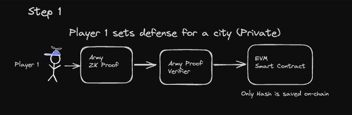
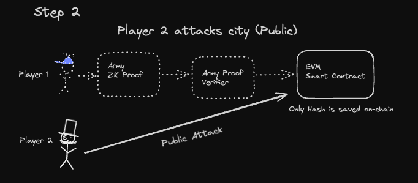
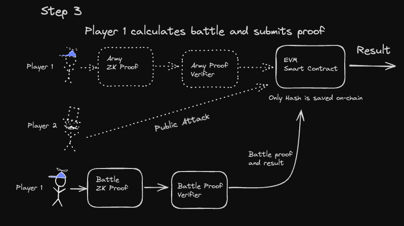
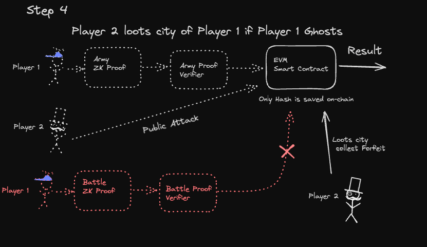

## Table of Contents
- [Shadow Warfare: Cities under Siege](#shadow-warfare--cities-under-siege)
    + [The World of Cities and Armies](#the-world-of-cities-and-armies)
    + [Art of war](#art-of-war)
    + [Triumphs, Rankings, and Rewards](#triumphs--rankings--and-rewards)
  * [How it all works](#how-it-all-works)
  * [Technologies used](#technologies-used)
    + [Scroll](#scroll)
    + [Noir](#noir)
  * [The Game State](#the-game-state)
    + [Enums](#enums)
    + [Structs](#structs)
  * [Public Facing Functions](#public-facing-functions)
    + [`buildCity`](#-buildcity-)
    + [`deployNewDefenseArmy`](#-deploynewdefensearmy-)
    + [`attack`](#-attack-)
    + [`reportAttack`](#-reportattack-)
    + [`surrender`](#-surrender-)
    + [`lootCity`](#-lootcity-)
  * [The Importance of Zero-Knowledge Proofs in the Game](#the-importance-of-zero-knowledge-proofs-in-the-game)
    + [Validate Army and Store Army Hash On-Chain](#validate-army-and-store-army-hash-on-chain)
    + [Report Opponent's Attack](#report-opponent-s-attack)
  * [Challenges and Hurdles](#challenges-and-hurdles)
  * [Deployed Contracts](#deployed-contracts)

# Shadow Warfare: Cities under Siege
---
 
Welcome to our strategic game world, where cities, battles, and tactics come to life in an immersive and secretive environment. Here's a brief overview of how the game unfolds, painting a mental map for your journey ahead:

### The World of Cities and Armies
Imagine a vast game world filled with numerous cities, each fortified and ready for battle. As a player, you enter this world by taking control of one of these cities, becoming its leader and protector. Upon joining, players take control of cities and secretly deploy defensive armies, hidden from rivals using zero-knowledge proofs (zk-SNARKs). We use Noir to generate these proofs, which are then verified on-chain with deployed EVM verifiers, ensuring rule compliance. Only the army's composition hash is stored on-chain, maintaining strategic secrecy and integrity.

### Art of war 
Offense is as crucial as defense. While your defensive army remains hidden, your attacking forces are visible to all, introducing a strategic dynamic of bluff and counterbluff. Your approach to warfare, balancing secrecy with show of strength, will determine victory or defeat, influencing your journey in the game's competitive landscape.

At this proof of concept stage, the game features a trio of units: tanks, artillery, and infantry, each with specific advantages in a classic rock-paper-scissors setup. Infantry overpowers artillery, artillery has an advantage over tanks, and tanks dominate infantry. 
This dynamic introduces an additional layer of strategy but is subject to change as the game evolves, ensuring a continually fresh and challenging competitive landscape.

### Triumphs, Rankings, and Rewards

Success in battle translates to points, propelling players up the rankings and unlocking access to future network airdrops and rewards.

## How it all works 

In Step 1, Player 1 sets up his defense for the city, which is kept private. Only the defense hash is stored on-chain to keep him honest, and to make sure he cannot change it later.

In Step 2, Player 2 attacks the city of Player 1. The attacking army composition is Public.
The attacker's army is stored among the defender's city data to make it easy for report the battle attack in step 3.  

In Step 3, Player 1 computes the battle result off-chain, and generates a proof of that computation along with the result. 
The Proof is verified on-chain and the result is stored on-chain.  

In Optional Step 4, in case Player 1 ghosts, we let Player 2 collect forfeir (loot city) aafter a certain time period.

## Technologies used

### Scroll 
We've selected Scroll for its seamless EVM compatibility and robust support for precompiled verifiers across major DSLs like Circom and Noir. This choice allows our game to efficiently utilize zero-knowledge proofs within EVM ecosystems, ensuring scalability and broad blockchain compatibility.

### Noir
We use Noir, a DSL tailored for zero-knowledge proofs, to generate off-chain proofs and on-chain verifiers, ensuring the privacy of strategic game elements like army compositions. This method keeps sensitive information concealed, maintaining gameplay surprise and depth.

## The Game State 
 The game state is represented through several enums, structs, and a game record that collectively manage the dynamics of warfare, defense, and city management.

 ### Enums

- `CityStatus`: This enumeration defines the possible states a city can be in within the game. The statuses include:
  - `NonExistant`: The city does not exist in the game.
  - `InPeace`: The city is not currently engaged in any conflict.
  - `UnderAttack`: The city is currently being attacked by another player.
  - `Destroyed`: The city has been conquered and is no longer in play.
  - `Defended`: The city has successfully repelled an attack.
  - `Surrendered`: The city has given up without a fight.

### Structs

- `Army`: Represents the composition of a player's army, including the quantity of infantry, artillery, and tanks. This structure is crucial for determining the outcome of battles based on the game's combat rules.

- `City`: Contains all relevant information about a player's city, including:
  - `defenseArmyHash`: A hash representing the composition of the city's defensive army, keeping the exact details secret while allowing for verification.
  - `cityStatus`: The current status of the city, as defined by the `CityStatus` enumeration.
  - `points`: Points accumulated by the city, used for ranking and progression in the game.
  - `attacker`: The address of the player attacking the city, if any.
  - `attackedAt`: A timestamp or block number indicating when the city was last attacked.
  - `target`: The address of the city being targeted for attack, if the city is currently attacking another.
  - `attackingArmy`: The composition of the army being used to attack another city, if applicable.

- `GameRecord`: Maintains overall records for the game, including:
  - `attackNonce`: A counter used to ensure the uniqueness of each attack.
  - `player`: A mapping from player addresses to their corresponding `City` data, linking players to their in-game entities.
  - `attackable`: An array of addresses representing cities that are eligible to be attacked, helping players identify potential targets.

## Public Facing Functions 

The smart contract defines several public-facing functions that facilitate the core gameplay mechanics, including city building, army deployment, attacking, defending, and surrendering. Here's a breakdown of each function and its purpose within the game:

### `buildCity`

- **Purpose**: Registers a player in the game by building a city with default parameters. This function implicitly calls `defendCity` to deploy the city's initial defense army.
- **Parameters**:
  - `_proof`: A byte array containing the zero-knowledge proof to verify the defense army's validity without revealing its composition.
  - `defenseArmyHash`: A bytes32 hash representing the encrypted composition of the defense army, ensuring its secrecy.
- **Modifiers**: `canBuild` ensures that the conditions for building a city are met before execution.
- **Visibility**: External, allowing it to be called from outside the contract.

### `deployNewDefenseArmy`

- **Purpose**: Allows a player to deploy a new defense army if their current army is defeated in battle. This function is essential for players to recover from losses and continue participating in the game.
- **Parameters**:
  - `_proof`: Similar to `buildCity`, a byte array for the zero-knowledge proof of the new defense army.
  - `defenseArmyHash`: The hash of the new defense army's composition.
- **Visibility**: External, to be called by players when needed.

### `attack`

- **Purpose**: Enables a player to initiate an attack on another city by committing an attacking army.
- **Parameters**:
  - `_target`: The address of the city (and its owner) being attacked.
  - `_attackerArmy`: A struct representing the composition of the attacking army.
- **Modifiers**: `isAttackable(_target)` checks if the target city is eligible for attack.
- **Visibility**: External, facilitating player interactions through battles.

### `reportAttack`

- **Purpose**: Used by players to report the outcome of a battle. Winning defends the city and earns points, while losing requires rebuilding the city.
- **Parameters**:
  - `battle_result`: An unsigned integer representing the battle's outcome.
  - `_proof`: A byte array containing the proof of honesty for the reported result.
- **Visibility**: External, enabling players to conclude and resolve battles.

### `surrender`

- **Purpose**: Allows a player to surrender when their city is under attack, providing an alternative to fighting.
- **Modifiers**: `isUnderAttack` ensures this function is only callable when the player's city is actively being attacked.
- **Visibility**: External, offering a strategic option for players in dire situations.

### `lootCity`

- **Purpose**: Enables a player to claim victory points if their opponent fails to report the clash result within a specified timeframe. This function serves as a penalty for inactivity and a reward for the attacking player's aggression.
- **Visibility**: External, incentivizing timely responses and active participation in the game.

These functions together create a comprehensive gameplay experienc

## The Importance of Zero-Knowledge Proofs in the Game

Zero-knowledge proofs play a critical role in maintaining the strategic depth and fairness of the game. Here's how they contribute to key gameplay elements:

### Validate Army and Store Army Hash On-Chain

- **Why?** Zero-knowledge proofs allow the validation of a player's army without revealing its composition to the public or the opponent. By storing only the hash of the army's composition on-chain, the game ensures that the details of a player's defensive army remain private. This secrecy is crucial for strategic planning and defense, as it prevents opponents from tailoring their attacks to exploit specific weaknesses in the defender's army.

### Report Opponent's Attack

- **Why?** Reporting the outcome of an opponent's attack using zero-knowledge proofs serves multiple purposes:
  1. **Maintaining Secrecy of the Defending Army**: Even when reporting the results of an attack, the defending player's army composition remains masked, preserving the element of surprise for future battles.
  2. **Defensive Success**: If a player successfully defends their city, there is no need to alter their defensive strategy. Therefore, keeping the defending army private ensures that the successful defense can be reused without giving away its composition.
  3. **Requirement to Rebuild After Loss**: In cases where the city is destroyed or the player chooses to forfeit, the requirement to build a new army and validate it again through zero-knowledge proofs ensures that players are actively engaged in maintaining and updating their strategies. It also resets the strategic landscape, preventing opponents from gaining undue advantage from prior knowledge of a city's defenses.

Zero-knowledge proofs thus serve as a foundational technology in the game, ensuring fairness, privacy, and strategic depth. They allow players to engage in complex battles and defense strategies without compromising the secrecy necessary for a dynamic and competitive gaming experience.

## Challenges and Hurdles

Throughout the development of our game, we encountered several significant challenges that tested our team's resilience and adaptability. From the onset, these hurdles shaped our journey, pushing us to explore new technologies and adapt to unforeseen circumstances.

- **Late Team Assembly**: Our project kicked off with the challenge of having formed our team later than ideal. This delay in team assembly put us on a compressed schedule, requiring rapid alignment of our objectives, swift adoption of roles, and an accelerated development pace to catch up with our initial timeline.

- **Navigating New Technologies**: This project marked our first experience with both Noir and Foundry, introducing us to the intricacies of zero-knowledge proofs and advanced smart contract development. 

- **Solidity Development Experience**: Our collective experience in Solidity development was modest at the outset of this project. It is very possible that there are potential security vulnerabilities within our contracts.

- **Health Setback**: Adding to our challenges, one of our key team members fell ill, resulting in a loss of almost a week's worth of progress. 

- **Sindri**: We also explored integrating with Sindri, but encountered challenges due to the apparent lack of recent updates for Noir support in Sindri's documentation. Additionally, we found the available documentation and tutorials for Sindri to be insufficiently comprehensive. Given our time constraints, we ultimately decided to refrain from using it for this project.

## Deployed Contracts 

  * ArmyVerifier created at address:  0x4B2d83eF3BE7d4451669bF96ad4B6A799487A1d7
  * BattlerVerifier created at address:  0x00144DA41F108185330f76c68d71ce4a0f432d8d
  * AutoBattler created at address:  0x4f8169e076AD56eA14E77575d5f6c52F9F19f153

  Verified Contract can be seen at: 
  https://sepolia.scrollscan.dev/address/0x4f8169e076AD56eA14E77575d5f6c52F9F19f153#code