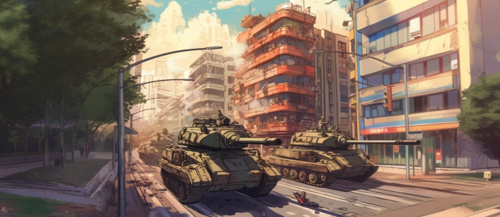

# Shadow Warfare: Cities under Siege
---
<br/>
Welcome to our strategic game world, where cities, battles, and tactics come to life in an immersive and secretive environment. Here's a brief overview of how the game unfolds, painting a mental map for your journey ahead:

### The World of Cities and Armies
Imagine a vast game world filled with numerous cities, each fortified and ready for battle. As a player, you enter this world by taking control of one of these cities, becoming its leader and protector. Upon joining, players take control of cities and secretly deploy defensive armies, hidden from rivals using zero-knowledge proofs (zk-SNARKs). We use Noir to generate these proofs, which are then verified on-chain with deployed EVM verifiers, ensuring rule compliance. Only the army's composition hash is stored on-chain, maintaining strategic secrecy and integrity.

### Art of war 
Offense is as crucial as defense. While your defensive army remains hidden, your attacking forces are visible to all, introducing a strategic dynamic of bluff and counterbluff. Your approach to warfare, balancing secrecy with show of strength, will determine victory or defeat, influencing your journey in the game's competitive landscape.

At this proof of concept stage, the game features a trio of units: tanks, artillery, and infantry, each with specific advantages in a classic rock-paper-scissors setup. Infantry overpowers artillery, artillery has an advantage over tanks, and tanks dominate infantry. 
This dynamic introduces an additional layer of strategy but is subject to change as the game evolves, ensuring a continually fresh and challenging competitive landscape.

### Triumphs, Rankings, and Rewards

Success in battle translates to points, propelling players up the rankings and unlocking access to future network airdrops and rewards.


## The Game State 
 The game state is represented through several enums, structs, and a game record that collectively manage the dynamics of warfare, defense, and city management.

```solidity
    enum CityStatus {
        NonExistant,
        InPeace,
        UnderAttack,
        Destroyed,
        Defended,
        Surrendered
    }

    /// STRUCTS ///
    struct Army {
        uint256 infantry;
        uint256 artillery;
        uint256 tanks;
    }

    struct City {
        bytes32 defenseArmyHash;
        CityStatus cityStatus;
        uint256 points;
        address attacker;
        uint256 attackedAt;
        address target;
        Army attackingArmy;
    }

    struct GameRecord {
        uint256 attackNonce; // clash counter
        mapping(address => City) player; // map player address to City Data
        address[] attackable; // record of attackable cities infered by player address
    }
```

 ### Enums

- `CityStatus`: This enumeration defines the possible states a city can be in within the game. The statuses include:
  - `NonExistant`: The city does not exist in the game.
  - `InPeace`: The city is not currently engaged in any conflict.
  - `UnderAttack`: The city is currently being attacked by another player.
  - `Destroyed`: The city has been conquered and is no longer in play.
  - `Defended`: The city has successfully repelled an attack.
  - `Surrendered`: The city has given up without a fight.

### Structs

- `Army`: Represents the composition of a player's army, including the quantity of infantry, artillery, and tanks. This structure is crucial for determining the outcome of battles based on the game's combat rules.

- `City`: Contains all relevant information about a player's city, including:
  - `defenseArmyHash`: A hash representing the composition of the city's defensive army, keeping the exact details secret while allowing for verification.
  - `cityStatus`: The current status of the city, as defined by the `CityStatus` enumeration.
  - `points`: Points accumulated by the city, used for ranking and progression in the game.
  - `attacker`: The address of the player attacking the city, if any.
  - `attackedAt`: A timestamp or block number indicating when the city was last attacked.
  - `target`: The address of the city being targeted for attack, if the city is currently attacking another.
  - `attackingArmy`: The composition of the army being used to attack another city, if applicable.

- `GameRecord`: Maintains overall records for the game, including:
  - `attackNonce`: A counter used to ensure the uniqueness of each attack.
  - `player`: A mapping from player addresses to their corresponding `City` data, linking players to their in-game entities.
  - `attackable`: An array of addresses representing cities that are eligible to be attacked, helping players identify potential targets.


